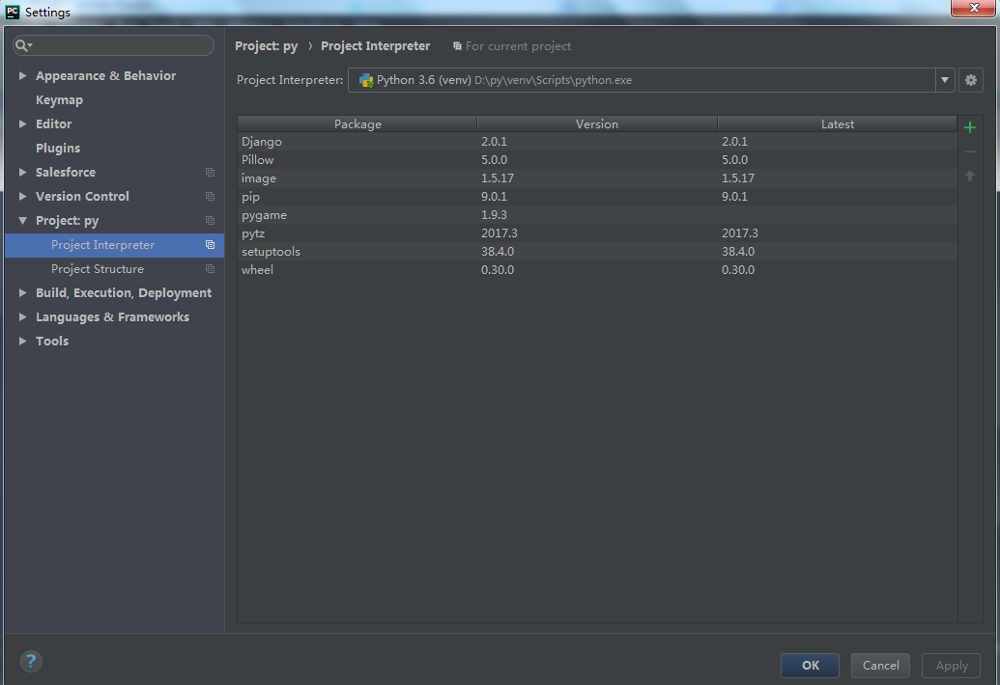
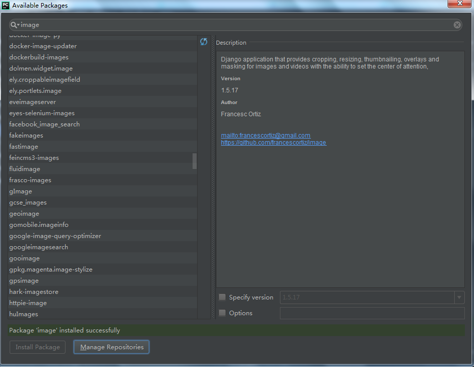

# Python Package Install
+ pip 命令安装
    ### pip command
    |命令|描述|
    |:---:|:---:|
    |pip[3] --version|显示pip版本|
    |pip[3] list|查看已安装的库|
    |pip3(2) install packageName|安装python3(2)库|
    |pip[3] install --upgrade packageName|升级库|
    |pip[3] uninstall packageName|卸载库|
    |pip[3] show packageName|显示库的信息|
+ 使用PyCharm安装
    + 打开设置窗口-Project:py->Project Interpreter->点击右侧'+'
    ---
    
    + 在搜索框内输入待安装的库命->点击'Install Package'->显示安装成功提示信息
    ---
    
    + 返回设置窗口，可以查看当前安装的所有库